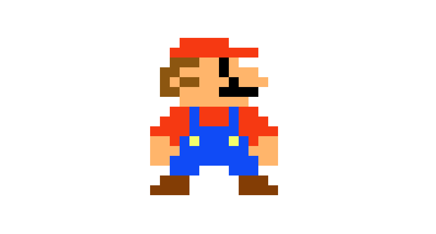

# css_pixel_mario

Playing around with creating sprites using css box-shadow.

    

👩🏻‍💻 See it live [here](https://codepen.io/Corrine2212/pen/MWZpGvp)

### To do:   
- [ ] add css background
- [ ] add music?
